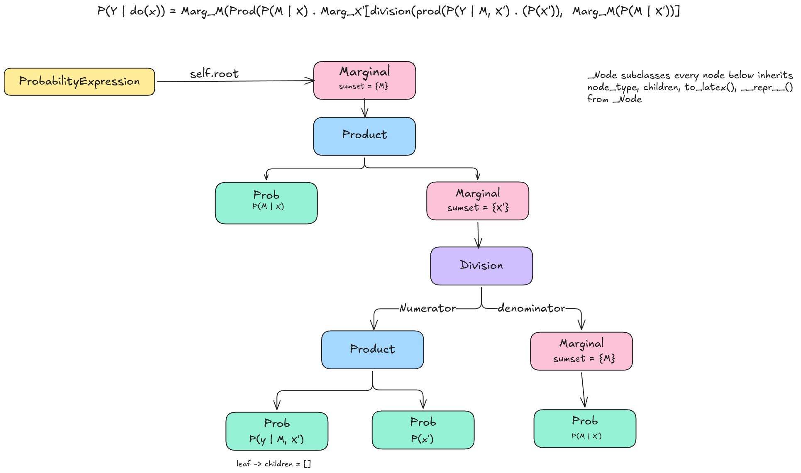

## Expand Causal Identification Module

**Contributors**: [kajal-jotwani](https://github.com/kajal-jotwani)

### Introduction
 
pgmpy already supports several graphical causal identification strategies, such as the backdoor criterion, frontdoor criterion, and instrumental variables. These existing methods are **role-based**: they inspect the causal graph and assign roles to nodes (e.g., identifying a valid adjustment set or instrument). All three methods inherit from the `_BaseIdentification` class, they accept a `causal_graph` with `exposures` and `outcomes` roles assigned, and return a **modified graph** with additional role assignments (e.g., `adjustment`, `frontdoor`, `iv`).
 
While this role-based design is clean and composable, it has a fundamental limitation: **it is incomplete**. Role-based methods can only identify causal effects for which a specific graphical criterion is satisfied. There exist valid causal models where none of these criteria apply, yet the interventional distribution `P(y | do(x))` is still theoretically identifiable from purely observational data.
 
The canonical example is the **bow-arc** graph from Shpitser & Pearl (2006):
 
```
X → Z → Y
X ↔ Z       (bidirected arc — latent confounder U affects both X and Z)
```
 
In this ADMG:
- **No valid backdoor adjustment set exists** - the latent confounder between X and Z is unobserved, so it cannot be conditioned on.
- **Frontdoor criterion does not apply** - there is a bidirected arc from X to Z, meaning Z itself is confounded with X.
- **No standard instrumental variable** - there is no variable that affects X without also being affected by the confounder. 
Yet `P(Y | do(X))` is identifiable, and the ID algorithm derives the correct formula automatically:
 
$$
P\bigl(Y \mid \mathrm{do}(X)\bigr) = \sum_{Z} \left[ P(Z \mid X) \cdot \sum_{X'} \left[ P(Y \mid Z, X') \cdot P(X') \right] \right]
$$

This project proposes extending pgmpy's identification capabilities with **formula-returning** identification methods. Unlike role-based approaches, these algorithms output a closed-form symbolic expression over observed distributions for the target causal effect, or return `False` and store the witness subgraph in `self.hedge_` when identification is not possible. The ID algorithm (Shpitser & Pearl, 2006) is **complete** for semi-Markovian models - it strictly subsumes what backdoor, frontdoor, and IV criteria can achieve individually.

### Proposed Solution

The project has two main components.

**Component 1: `ProbabilityExpression`** - a symbolic expression hierarchy placed in `pgmpy/identification/probability_expressions.py`, representing the closed-form formulas output by identification algorithms. It supports pretty-printing (LaTeX) and numeric evaluation against observed data. This class and its subclasses are pure data containers - they hold and render formula trees.
 
**Component 2: A new base class `_BaseFormulaIdentification`** added to `pgmpy/identification/base.py`, alongside the existing `_BaseIdentification`, which will be renamed to `_BaseGraphicalIdentification` for clarity. This new base class defines the formula-returning identification methods: `identify()` takes a causal graph and returns a `ProbabilityExpression`, or returns `False` when identification fails (storing the witness subgraph in `self.hedge_`). The four algorithms `ID`, `IDC`, `IDStar`, and `SigmaID` inherit from this base.

The two hierarchies are parallel and independent:

```
# Existing — unchanged
_BaseGraphicalIdentification    (base.py)
    identify() → (modified_graph, bool)
    ├── adjustment
    └── frontdoor
 
# New — formula-returning
_BaseFormulaIdentification       (base.py)
    identify() → ProbabilityExpression
    ├── iD        ← P(y | do(x))
    ├── iDC       ← P(y | do(x), z)
    ├── iDStar    ← P(y_x) counterfactual queries
    └── sigmaID   ← P(y | do(x)) from multiple data sources
 
# Formula data containers — separate from the algorithms
ProbabilityExpression            (probability_expressions.py)
    ├── Prob
    ├── Marginal
    ├── Product
    └── Quotient
```
 
The four algorithms share a unified call pattern:
 
```python
algo = ID()
result = algo.identify(admg)      # returns ProbabilityExpression or False
if result is False:
    print(algo.hedge_.nodes())    # inspect the witness subgraph
else:
    print(result.to_latex())      # renders LaTeX formula
    algo.evaluate(admg, data=df)  # numeric estimate from observed data
```
 
| Algorithm | Query | Required roles | Failure |
|---|---|---|---|
| `ID` | $P(y \mid do(x))$ | `exposures`, `outcomes` | Returns `False`, sets `self.hedge_` |
| `IDC` | $P(y \mid do(x), z)$ | `exposures`, `outcomes`, `conditioning` | Returns `False`, sets `self.hedge_` |
| `IDStar` | $P(y_x)$ counterfactual | `exposures`, `outcomes` + query | Returns `False`, sets `self.hedge_` |
| `SigmaID` | $P(y \mid do(x))$ multi-source | `exposures`, `outcomes` + sigma graphs | Returns `False`, sets `self.hedge_` | 
 

### Alternative Solutions

[**`y0`** (Hoyt et al., 2025)](https://github.com/y0-causal-inference/y0) is a Python library that implements ID, IDC, ID*, IDC*, and sigma-ID. It represents probability expressions using a domain-specific language: `P(Y @ X)` means `P(Y | do(X))` and `Sum[A](P(A, B))` means marginalisation. Internally, each expression is an `Expression` object with a `get_variables()` method and supports LaTeX rendering. The ID algorithm runs on an `NxMixedGraph` (a networkx-based mixed graph) and returns an `Expression`. We can reference `y0`'s expression DSL for how to design the `ProbabilityExpression` field names, and their ID* and IDC* implementations as a guide for twin network construction in `IDStar`. Importantly, `y0` took nearly two years to implement ID* and IDC* correctly, fixing several bugs in the original algorithm — making it a valuable reference for edge cases.

[**R `causaleffect`** (Tikka & Karvanen, 2017)](https://github.com/santikka/causaleffect) is the canonical reference implementation. It represents every probability expression — whether atomic or composite — as a single named list (the `probability` object) with fields: `var` (variables), `cond` (conditioning set), `do` (intervention variables), `sumset` (marginalisation variables), `product` (boolean flag for products), `children` (list of sub-expressions), `fraction` (boolean flag for quotients), `num` and `den` (numerator/denominator). LaTeX rendering is in `get.expression()` which recursively walks this structure. We can take inspiration from causaleffect's field names when designing our `Prob` class, and use causaleffect as reference for testing: for any graph where causaleffect produces a formula, our `ID` should return an equivalent expression.

Rather than a single struct with boolean flags (causaleffect's approach), we prefer separate subclasses (`Marginal`, `Product`, `Quotient`) because they are more idiomatic Python, easier to pattern-match in the recursion, and straightforward to extend.

### Details of proposed solution

#### `_BaseFormulaIdentification` - New Base Class in `base.py`
 
A new base class is added to `pgmpy/identification/base.py`, directly below `_BaseIdentification` for all formula-returning identification methods:

#### pgmpy/identification/base.py

``` python
class _BaseFormulaIdentification:
    """
    Base class for identification methods that return symbolic probability
    expressions.
 
    Subclasses implement _identify() to run the identification algorithm
    and return a ProbabilityExpression, or return False and store the
    witness subgraph in self.hedge_ when identification is not possible.
    """

    # Subclasses set this to restrict which graph types are accepted.
    # Used in isinstance() check inside _validate_query().
    supported_graph_types = ()

    def _validate_query(self, causal_graph):
        if not isinstance(causal_graph, self.supported_graph_types):
            raise ValueError(
                f"causal_graph must be an instance of "
                f"{self.supported_graph_types} for this method. "
                f"Got {type(causal_graph).__name__}."
            )
        if not causal_graph.get_role("exposures"):
            raise ValueError(
                "causal_graph must have 'exposures' role assigned."
            )
        if not causal_graph.get_role("outcomes"):
            raise ValueError(
                "causal_graph must have 'outcomes' role assigned."
            )

    def identify(self, causal_graph):
        """
        Run the identification algorithm on a causal graph.
        Parameters
        ----------
        causal_graph : ADMG or DAG
            The causal graph with at minimum 'exposures' and 'outcomes'
            roles assigned.

        Returns
        -------
        ProbabilityExpression
            The symbolic formula for the identified causal effect.
            Access the expression tree via result.root.
        False
            If the causal effect is not identifiable. The witness
            subgraph is stored in self.hedge_.
        """
        self._validate_query(causal_graph)
        return self._identify(causal_graph)

    def _identify(self, causal_graph):
        """Override in subclasses to implement the algorithm."""
        raise NotImplementedError

    def __call__(self, causal_graph):
        return self.identify(causal_graph)
```

#### `ProbabilityExpression` - Container and Expression Tree
 
The ID algorithms output mathematical formulas that we represent as a **tree**. The tree is built from four node types: `Prob`, `Marginal`, `Product`, and `Division`. These nodes are **not** `ProbabilityExpression` instances they are the internal building blocks of the tree, and they all inherit from a private base class `_Node`.

`ProbabilityExpression` is the **container** returned by `identify()`. It holds a single attribute `root` pointing to the root node of the expression tree, and provides the public API (`to_latex()`, `evaluate()`, `simplify()`) by delegating to the root. The node types in the tree delegate rendering and evaluation recursively through `children`.

Every tree node shares the same traversal interface via `_Node`: `node.node_type` identifies the node type, and `node.children` gives its sub-nodes. Leaf nodes (`Prob`) always have `children = []`.

```python
# pgmpy/identification/probability_expressions.py


class _Node:
    """
    Private base class for all expression tree nodes.

    Not part of the public API. Provides the shared structure that
    makes uniform tree traversal possible: every node has
    node_type (str), children (list), to_latex(), and __repr__().

    Subclasses: Prob, Marginal, Product, Division.
    """

    node_type: str = ""
    children: list  # list[_Node]

    def to_latex(self):
        raise NotImplementedError

    def __repr__(self):
        raise NotImplementedError


class Prob(_Node):
    """
    Leaf node of the expression tree.

    Represents an atomic probability term
    $P(\text{variables} \mid do(\text{do}), \text{cond})$,
    with an optional marginalisation over ``sumset``.

    Parameters
    ----------
    variables : frozenset of str
        The random variables whose probability is expressed.
        For example, ``frozenset({"Y"})`` for $P(Y \mid \ldots)$.

    do : frozenset of str
        Variables being intervened on via the do-operator.
        For example, ``frozenset({"X"})`` for $P(Y \mid do(X))$.
        Pass ``frozenset()`` when there is no intervention.

    cond : frozenset of str
        Variables being passively conditioned on.
        For example, ``frozenset({"Z"})`` for $P(Y \mid Z)$.
        Pass ``frozenset()`` when there is no conditioning.

    sumset : frozenset of str
        Variables being marginalised out directly at this node.
        For example, ``frozenset({"Z"})`` for
        $\sum_{Z} P(Y, Z)$.
        Pass ``frozenset()`` when there is no marginalisation at
        this node.

    Notes
    -----
    ``children`` is always ``[]`` for ``Prob`` — it is a leaf node.
    """

    node_type = "prob"

    def __init__(
        self,
        variables,           # frozenset of str
        do=frozenset(),      # frozenset of str
        cond=frozenset(),    # frozenset of str
        sumset=frozenset(),  # frozenset of str
    ):
        self.variables = frozenset(variables)
        self.do = frozenset(do)
        self.cond = frozenset(cond)
        self.sumset = frozenset(sumset)
        self.children = []   # Prob is always a leaf

    def to_latex(self): ...
    def __repr__(self): ...


class Marginal(_Node):
    """
    Internal node representing $\sum_{\text{sumset}} \text{children}[0]$.

    Has exactly one child.

    Parameters
    ----------
    child : Prob or Marginal or Product or Division
        The expression being marginalised. Stored as ``children[0]``.

    sumset : frozenset of str
        The variables being summed out.
        For example, ``frozenset({"Z"})`` for $\sum_{Z}$.
    """

    node_type = "sum"

    def __init__(
        self,
        child,       # Prob | Marginal | Product | Division
        sumset,      # frozenset of str
    ):
        self.sumset = frozenset(sumset)
        self.children = [child]   # exactly one child

    def to_latex(self): ...
    def __repr__(self): ...


class Product(_Node):
    """
    Internal node representing
    $\text{children}[0] \cdot \text{children}[1] \cdot \ldots$

    Has two or more children.

    Parameters
    ----------
    factors : list of (Prob or Marginal or Product or Division)
        The expressions being multiplied. Must have at least two
        elements. Stored as ``children``.
    """

    node_type = "product"

    def __init__(
        self,
        factors,     # list[Prob | Marginal | Product | Division], len >= 2
    ):
        self.children = list(factors)

    def to_latex(self): ...
    def __repr__(self): ...


class Division(_Node):
    """
    Internal node representing
    $\dfrac{\text{children}[0]}{\text{children}[1]}$.

    Has exactly two children: numerator at index 0,
    denominator at index 1.

    Parameters
    ----------
    numerator : Prob or Marginal or Product or Division
        The numerator expression. Stored as ``children[0]``.

    denominator : Prob or Marginal or Product or Division
        The denominator expression. Stored as ``children[1]``.
    """

    node_type = "division"

    def __init__(
        self,
        numerator,    # Prob | Marginal | Product | Division
        denominator,  # Prob | Marginal | Product | Division
    ):
        self.children = [numerator, denominator]

    def to_latex(self): ...
    def __repr__(self): ...


class ProbabilityExpression:
    """
    Container for the output of a causal identification algorithm.

    ``ProbabilityExpression`` is NOT a tree node. It is the public
    API object returned by ``identify()``. It holds a single
    ``root`` attribute pointing to the root of the expression tree,
    and delegates ``to_latex()``, ``evaluate()``, and ``simplify()``
    to that root.

    The tree itself is composed of ``Prob``, ``Marginal``,
    ``Product``, and ``Division`` nodes (all subclasses of ``_Node``).
    Traverse the tree via ``expr.root.children`` recursively.

    Parameters
    ----------
    root : Prob or Marginal or Product or Division
        The root node of the expression tree.

    Attributes
    ----------
    root : Prob or Marginal or Product or Division
        The root node. Access sub-nodes via ``root.children``.

    Examples
    --------
    >>> expr.root.node_type
    'sum'
    >>> expr.root.children[0].node_type
    'product'
    >>> def print_tree(node, depth=0):
    ...     print("  " * depth + repr(node))
    ...     for child in node.children:
    ...         print_tree(child, depth + 1)
    >>> print_tree(expr.root)
    """

    def __init__(
        self,
        root,  # Prob | Marginal | Product | Division
    ):
        self.root = root

    def to_latex(self):
        """Return a LaTeX string for the full expression."""
        return self.root.to_latex()

    def __repr__(self):
        return repr(self.root)

    def simplify(self):
        """
        Return a simplified ``ProbabilityExpression``.

        Default: identity. Concrete rules — such as collapsing a
        ``Marginal`` with an empty ``sumset``, or cancelling common
        factors in a ``Division`` — are added during implementation
        alongside each algorithm.
        """
        return ProbabilityExpression(root=self.root)

    def evaluate(self, data):
        """
        Numerically evaluate the expression against observed data.

        Parameters
        ----------
        data : pd.DataFrame
            Observed data. Column names must match the variable names
            used in the expression tree.

        Returns
        -------
        float or np.ndarray
            Numeric estimate of the causal effect.
        """
        raise NotImplementedError
```
 
The frontdoor formula, as a `ProbabilityExpression` tree, illustrates how the pieces compose:
 
```python
# $P(Y \mid do(X)) = \sum_{M} \left[ P(M \mid X) \cdot \sum_{X'} \left[ P(Y \mid M, X') \cdot P(X') \right] \right]$
 
expr = Marginal(
    Product([
        Prob(frozenset({"M"}), cond=frozenset({"X"})),
        Marginal(
            Product([
                Prob(frozenset({"Y"}), cond=frozenset({"M", "X"})),
                Prob(frozenset({"X"})),
            ]),
            summed_vars=frozenset({"X"}),
        ),
    ]),
    summed_vars=frozenset({"M"}),
)
 
print(expr.to_latex())
# \sum_{M} \left[ P(M \mid X) \cdot \sum_{X} \left[ P(Y \mid M, X) P(X) \right] \right]
```

 
#### ID and IDC - Complete Identification of P(y | do(x)) and P(y | do(x), z)

These two algorithms will be implemented as the part of the Issue [#2529](https://github.com/pgmpy/pgmpy/issues/2529). Before the Implementation of the ID algorithms we need to add method to `get_c_components()` Issue [#3079](https://github.com/pgmpy/pgmpy/issues/3079) to the `ADMG` class.

The `ID` algorithm (Shpitser & Pearl, 2006) is complete for semi-Markovian causal models. It can identify any identifiable interventional distribution, and when identification is not possible, it returns `False` and stores the subgraph responsible in `self.hedge_`.
 
The algorithm works recursively on the graph's **C-components** (groups of nodes connected through latent confounders, that is, connected components of the bidirected skeleton). It tries nine rules in order: restricting to ancestors of the outcome, pushing redundant variables into the intervention set, decomposing across independent C-components, and expressing identification in terms of observed conditionals. If none of these apply, a hedge is found and the effect is not identifiable.
 
```python
# pgmpy/identification/id_algorithm.py
 
class ID(_BaseFormulaIdentification):
    """
    Identifies P(y | do(x)) in semi-Markovian causal models.
 
    Examples
    --------
    >>> from pgmpy.base import ADMG
    >>> from pgmpy.identification import ID
    >>> admg = ADMG(
    ...     directed_ebunch=[("X", "Z"), ("Z", "Y")],
    ...     bidirected_ebunch=[("X", "Z")],
    ...     roles={"exposures": "X", "outcomes": "Y"},
    ... )
    >>> result = ID().identify(admg)
    >>> print(result.to_latex())
    \sum_{Z} \left[ P(Z \mid X) \cdot \sum_{X} \left[ P(Y \mid Z, X) P(X) \right] \right]
    """
    supported_graph_types = (ADMG, DAG)
 
    def _identify(self, causal_graph):
        y = frozenset(causal_graph.get_role("outcomes"))
        x = frozenset(causal_graph.get_role("exposures"))
        P = Prob(frozenset(causal_graph.nodes()))
        return _id_recursive(y, x, P, causal_graph)
```
 
The core recursion lives in a standalone module-level function `_id_recursive(y, x, P, G)`. It is not a method on `ID` because the recursion calls itself on internal subgraphs that have no role assignments, so the class-level validation would break it.
 
The table below lists every `ADMG` method the algorithm needs. Some already exist in the current codebase; the rest will be added as part of this project:
 
| Method | Status | Notes |
|---|---|---|
| `G.get_ancestors(node_set)` | Already exists | Traverses directed edges only, which is exactly what the algorithm needs |
| `G.get_ancestral_graph(node_set)` | Already exists | Returns the induced ADMG subgraph over ancestor nodes |
| `G.is_mseparated(u, v, observed)` | Already exists | Used by IDC for the d-separation check |
| `G.get_c_components()` | To be added ([#3079](https://github.com/pgmpy/pgmpy/issues/3079)) | `get_district(node)` already exists per node; this extends it to partition the full graph |
| `G.do(node_set)` | To be added for `ADMG` (already exists in `DAG`) | Returns the mutilated graph with incoming directed edges into `node_set` removed, i.e. computes `G_{\bar{X}}` |
| `G.topological_sort(node_set)` | To be added | Topological order restricted to a given node set, built on top of the existing directed-edge structure |
| `G.predecessors_before(vi, ordered)` | To be added | Returns nodes appearing before `vi` in a given topological ordering |
 
`IDC` handles the conditional case `P(y | do(x), z)`. It first checks if the intervention is actually needed using a d-separation test on `G_{\bar{X}}`. If it is, it breaks the query into a ratio of two `ID` calls:

$$
P(y \mid do(x), z) = \frac{P(y, z \mid do(x))}{P(z \mid do(x))}
$$
 
```python
class IDC(_BaseFormulaIdentification):
    """
    Identifies P(y | do(x), z). Requires a 'conditioning' role on the graph.
 
    Examples
    --------
    >>> admg = ADMG(
    ...     directed_ebunch=[("X", "Z"), ("Z", "Y"), ("X", "Y")],
    ...     bidirected_ebunch=[("X", "Y")],
    ...     roles={"exposures": "X", "outcomes": "Y", "conditioning": "Z"},
    ... )
    >>> result = IDC().identify(admg)
    >>> print(result.to_latex())
    """
    supported_graph_types = (ADMG, DAG)
 
    def _identify(self, causal_graph):
        y = frozenset(causal_graph.get_role("outcomes"))
        x = frozenset(causal_graph.get_role("exposures"))
        z = frozenset(causal_graph.get_role("conditioning"))
 
        G_bar_x = causal_graph.do(x)
        if G_bar_x.is_mseparated(y, x, conditional_set=z):
            return Prob(y, cond=x | z)
 
        P = Prob(frozenset(causal_graph.nodes()))
        return Quotient(
            _id_recursive(y | z, x, P, causal_graph),
            _id_recursive(z,     x, P, causal_graph),
        )
```
 
#### `IDStar` - Counterfactual Identification of `P(y_x)`
 
ID* (Shpitser & Pearl, 2008) handles counterfactual queries, basically questions like "what would Y have been if X had been set to x?", written as `P(Y_x = y)` in potential outcomes notation.
 
The algorithm builds a **parallel worlds graph** (twin network): a combined ADMG that duplicates nodes for each intervention context in the query, and connects the worlds through their shared latent variables (bidirected edges). Identification then runs on this expanded graph.
 
```python
class IDStar(_BaseFormulaIdentification):
    """
    Identifies counterfactual queries P(y_x) via the ID* algorithm.
 
    Parameters
    ----------
    counterfactual_query
        Each tuple is (variable, intervention_context), e.g.
        [("Y", {"X": 1})] represents P(Y_{X=1}).
 
    Examples
    --------
    >>> result = IDStar(
    ...     counterfactual_query=[("Y", {"X": 1})]
    ... ).identify(admg)
    >>> print(result.to_latex())
    """
    supported_graph_types = (ADMG,)
 
    def __init__(self, counterfactual_query):
        self.counterfactual_query = counterfactual_query
 
    def _identify(self, causal_graph):
        twin_graph = self._construct_twin_network(causal_graph)
        return _id_star_recursive(causal_graph, twin_graph,
                                  self.counterfactual_query)
```
 
#### `SigmaID` - Identification from Multiple Data Sources
 
sigma-ID (Bareinboim & Pearl, 2012) handles the case where you have more than one data source, for example an observational dataset alongside a partial randomised experiment. It generalises the ID algorithm to make use of this extra information, using sigma-calculus annotated graphs to track which variables were randomised in each source.
 
```python
class SigmaID(_BaseFormulaIdentification):
    """
    Identifies P(y | do(x)) from multiple observational and/or experimental
    distributions using the sigma-ID algorithm.
 
    Parameters
    ----------
    sigma_graphs
        One ADMG per available data source, annotated to indicate which
        variables were randomised in that source.
 
    Examples
    --------
    >>> result = SigmaID(
    ...     sigma_graphs=[obs_admg, rct_admg]
    ... ).identify(obs_admg)
    >>> print(result.to_latex())
    """
    supported_graph_types = (ADMG,)
 
    def __init__(self, sigma_graphs):
        self.sigma_graphs = sigma_graphs
 
    def _identify(self, causal_graph):
        ...
```

### Module Structure
 
```
pgmpy/
├── identification/
│   ├── __init__.py                  <- exports all public classes
│   ├── base.py                      <- _BaseGraphicalIdentification (renamed)
│   ├── adjustment.py                <- Adjustment (unchanged)
│   ├── frontdoor.py                 <- Frontdoor (unchanged)
│   ├── probability_expressions.py   <- NEW: ProbabilityExpression,
│   │                                   Prob, Marginal, Product, Quotient
│   ├── id_algorithm.py              <- NEW: ID, IDC, _id_recursive()
│   ├── id_star.py                   <- NEW: IDStar, _id_star_recursive()
│   └── sigma_id.py                  <- NEW: SigmaID
```

## Testing Plan

The testing plan is split into three layers so each piece can be checked on its own before the pieces are combined.

### Layer 1: `ProbabilityExpression` unit tests

These tests focus on the expression tree only. They should not touch any graph code. The goal is to verify that the basic building blocks behave like a clean, predictable data structure.

- Check that `Prob`, `Marginal`, `Product`, and `Quotient` can be constructed with the expected children and stored arguments.
- Verify the tree shape is consistent across all node types, so traversal code can treat them uniformly.
- Use a frontdoor-style expression as a rendering regression test, since it exercises `Prob`, `Marginal`, and `Product` in one example.

### Layer 2: ID and IDC integration tests

These tests should use canonical graphs from the literature and check the full identification flow end to end.

- The bow-arc graph should confirm that ID succeeds on a case where backdoor and frontdoor do not apply.
- A simple DAG with no confounding should reduce to the expected direct expression.
- A frontdoor graph should recover the marginal-over-mediator form.
- A clearly non-identifiable graph should return `False` and leave a witness graph in `self.hedge_`.
- IDC should be tested with a case where the conditional query turns into a quotient of two ID calls.

### Layer 3: Cross-validation against reference implementations

For graphs where `causaleffect` produces a formula, the returned expression should match our tree structure and symbolic content. Exact ordering inside sets does not matter, but the node types and recursive layout should line up.

- Add a small helper for structural equivalence checks.
- Parametrize tests using examples from Tikka and Karvanen (2017), especially the worked cases in Section 5.
- Compare the LaTeX output as a secondary check when a reference formula is available.

Together, these layers cover the expression container, the algorithmic core, and the compatibility surface with existing references.

## User Journeys with the Solution

#### Journey 1: Researcher - Automatic identification in a confounded model

A researcher has a model where a latent variable confounds both the treatment X and the mediator Z, so no backdoor adjustment exists. Instead of manually deriving the identification formula, they let the ID algorithm do it.

```python
from pgmpy.base import ADMG
from pgmpy.identification import ID

admg = ADMG(
    directed_ebunch=[("X", "Z"), ("Z", "Y")],
    bidirected_ebunch=[("X", "Z")],
    roles={"exposures": "X", "outcomes": "Y"},
)

result = ID().identify(admg)
print(result.to_latex())
# \sum_{Z} \left[ P(Z \mid X) \cdot \sum_{X} \left[ P(Y \mid Z, X) P(X) \right] \right]
```

#### Journey 2: Data Scientist - Checking identifiability before estimation

Before spending time on estimation, a data scientist wants to know upfront whether the causal effect can be identified from observational data at all. If not, the algorithm tells them exactly which subgraph makes it impossible.

```python
from pgmpy.identification import ID

algo = ID()
result = algo.identify(admg)

if result is False:
    print("Not identifiable.")
    print("Hedge nodes:", list(algo.hedge_.nodes()))
    print("Hedge edges:", list(algo.hedge_.edges()))
else:
    numeric = algo.evaluate(admg, data=df)
    print(f"Estimated causal effect: {numeric:.3f}")
```

#### Journey 3: Epidemiologist - Conditional interventional distribution

An epidemiologist wants to estimate the effect of a treatment X on outcome Y, but needs to condition on an observed baseline variable Z, for example a pre-treatment health score. IDC handles this directly without needing to manually apply Bayes' rule on top of the ID result.

```python
from pgmpy.base import ADMG
from pgmpy.identification import IDC

admg = ADMG(
    directed_ebunch=[("X", "Z"), ("Z", "Y"), ("X", "Y")],
    bidirected_ebunch=[("X", "Y")],
    roles={"exposures": "X", "outcomes": "Y", "conditioning": "Z"},
)
result = IDC().identify(admg)
print(result.to_latex())
```

### References
 
1. Shpitser, I. and Pearl, J. (2006). *Identification of Joint Interventional Distributions in Recursive Semi-Markovian Causal Models.* AAAI-06.
2. Shpitser, I. and Pearl, J. (2006). *Identification of Conditional Interventional Distributions.* UAI-06.
3. Shpitser, I. and Pearl, J. (2008). *Complete Identification Methods for the Causal Hierarchy.* JMLR, 9, 1941–1979.
4. Bareinboim, E. and Pearl, J. (2012). *Causal Inference by Surrogate Experiments: z-Identifiability.* UAI-12.
5. Hoyt, C.T., et al. (2025). *Causal identification with Y0.* arXiv:2508.03167.  
6. Tikka, S. and Karvanen, J. (2017). *Identifying Causal Effects with the R Package causaleffect.* JSS, 76(12).